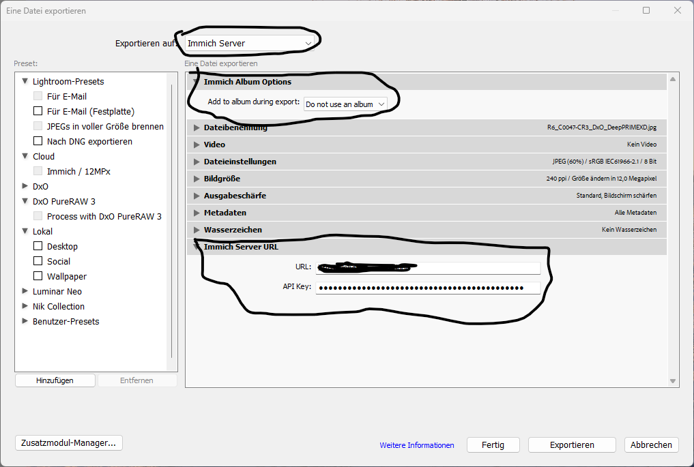

# lrc-immich-plugin

A Lightroom Classic plugin created with Lightroom SDK which uploads images to an Immich Server via the Immich API.

## Support my work

## Installation

Download the current release zip file and extract it to the Lightroom plugin folder, which is:

Mac
    `/Users/$USER/Library/Application Support/Adobe/Lightroom/Modules/`

Windows
    `C:\Users\%USERNAME%\AppData\Roaming\Adobe\Lightroom\Modules`

Alternatively extract it somewhere good an go to Lightroom Module Manager and add it via the GUI.

Either there should be a plugin called "Immich plugin" in the list, one you're finished.

## Features

* Setup connection to your Immich instance via URL and API key.
* Optionally choose or create an album to use on export to Immich.
* Export/Upload images to Immich.

## Usage

After you successfully installed the plugin, you can create an export preset in Lightroom.

Basically you have to set three parameters:

* Set Export To: Immich Server (in the dropdown at the top)
* Enter the immich http URL where the web frontend is reachable.
* Enter an API for your Immich account. ([This has to be setup in Immich.](https://immich.app/docs/features/command-line-interface#obtain-the-api-key))
* Optionally choose to create an album, choose an exisiting album, choose on export, or do not use any albums on upload.

Once you're done entering the details, edit the usual Lightroom export parameters to your need, and save the preset.

## CREDITS

[Jeffrey Friedl for JSON.lua](http://regex.info/blog/lua/json)

[Enrique García Cota for inspect.lua](https://github.com/kikito/inspect.lua)

## FINISHED

You should be able to export images directly to your Immich server.
If not open an issue, please.

